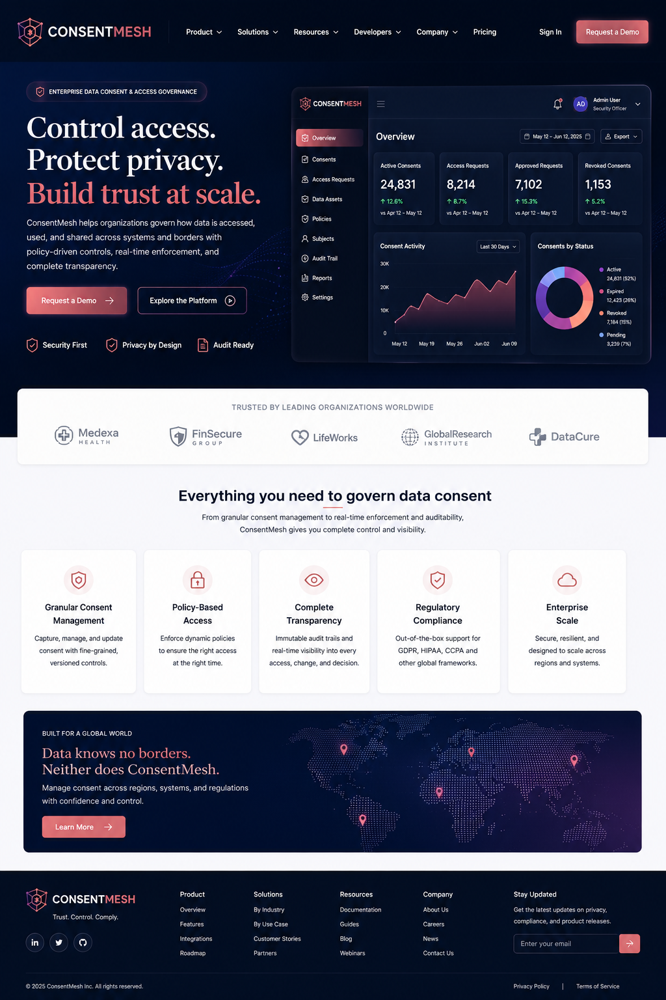

# ConsentMesh



**Distributed Data Consent & Access Governance Platform**

ConsentMesh is a production-oriented portfolio project that demonstrates
how a modern distributed system can manage consent, authorization
policies, sensitive-data access, and immutable audit trails across
independently deployable services.

> **Project status:** In Development\
> **Primary stack:** C# / .NET 8, ASP.NET Core, Microsoft Azure,
> React/TypeScript, Azure Service Bus, Azure SQL/Cosmos DB, Microsoft
> Entra ID, OAuth 2.0, OpenID Connect, JWT, Docker, OpenTelemetry,
> Application Insights, GitHub Actions

------------------------------------------------------------------------

## Table of Contents

1.  [Project Vision](#project-vision)
2.  [Problem Statement](#problem-statement)
3.  [Goals](#goals)
4.  [Non-Goals](#non-goals)
5.  [Core Use Cases](#core-use-cases)
6.  [Personas and Roles](#personas-and-roles)
7.  [Functional Requirements](#functional-requirements)
8.  [Non-Functional Requirements](#non-functional-requirements)
9.  [Architecture Overview](#architecture-overview)
10. [Service Responsibilities](#service-responsibilities)
11. [Project Structure](#project-structure)
12. [Domain Model](#domain-model)
13. [Consent Lifecycle](#consent-lifecycle)
14. [Authorization Model](#authorization-model)
15. [Authentication and Identity](#authentication-and-identity)
16. [Event-Driven Architecture](#event-driven-architecture)
17. [Event Catalog](#event-catalog)
18. [Data Architecture](#data-architecture)
19. [API Design](#api-design)
20. [Resilience and Distributed-System
    Patterns](#resilience-and-distributed-system-patterns)
21. [Auditability](#auditability)
22. [Security](#security)
23. [Privacy](#privacy)
24. [Azure Architecture](#azure-architecture)
25. [Observability](#observability)
26. [Production Support](#production-support)
27. [CI/CD](#cicd)
28. [Environments](#environments)
29. [Local Development](#local-development)
30. [Configuration](#configuration)
31. [Testing Strategy](#testing-strategy)
32. [Performance and Load Testing](#performance-and-load-testing)
33. [Failure Scenarios](#failure-scenarios)
34. [Deployment Strategy](#deployment-strategy)
35. [Database Migrations](#database-migrations)
36. [API Versioning](#api-versioning)
37. [Feature Flags](#feature-flags)
38. [Example End-to-End Workflow](#example-end-to-end-workflow)
39. [Definition of Done](#definition-of-done)
40. [Development Roadmap](#development-roadmap)
41. [Git Workflow](#git-workflow)
42. [Documentation](#documentation)
43. [Demo Plan](#demo-plan)
44. [Resume Skills Demonstrated](#resume-skills-demonstrated)
45. [Future Enhancements](#future-enhancements)
46. [License](#license)

------------------------------------------------------------------------

## Project Vision

ConsentMesh provides a centralized governance layer for answering a
deceptively difficult question:

**May this person, application, or service access this protected
resource right now, for this purpose, under the currently valid consent
and organizational policies?**

The platform is designed around real enterprise concerns rather than a
simple CRUD workflow. Consent can be granted, scoped, amended, expired,
or revoked. Authorization decisions can depend on identity, role,
claims, resource type, purpose, time window, application, and current
consent state. Changes propagate asynchronously to dependent services,
and security-sensitive activity is captured in an immutable audit trail.

The project is intentionally designed to demonstrate production software
engineering across application development, distributed systems, cloud
infrastructure, identity, security, messaging, observability, testing,
deployment, and operational support.

------------------------------------------------------------------------

## Problem Statement

Organizations that handle sensitive information often have multiple
applications and services that need to determine whether access to a
resource is permitted. Embedding authorization logic independently in
every application creates several problems:

-   inconsistent policy enforcement;
-   stale consent information;
-   difficult revocation;
-   duplicated authorization logic;
-   weak auditability;
-   tightly coupled applications;
-   limited visibility into why access was allowed or denied;
-   increased security and compliance risk.

ConsentMesh separates consent management and policy evaluation into
dedicated services and distributes state changes through events.

------------------------------------------------------------------------

## Goals

ConsentMesh should:

-   provide explicit, time-bound, purpose-aware consent;
-   support grant, amendment, suspension, expiration, and revocation;
-   make authorization decisions using identity claims, policy, consent,
    and resource context;
-   provide standards-based authentication using OAuth 2.0 and OpenID
    Connect;
-   authorize API calls using JWT access tokens and policy-based
    authorization;
-   demonstrate secure service-to-service communication;
-   publish domain and integration events through Azure Service Bus;
-   tolerate transient failures without losing business events;
-   make consumers idempotent;
-   provide dead-letter handling and replay workflows;
-   create tamper-resistant audit records;
-   expose distributed traces, logs, metrics, health checks, and alerts;
-   automate testing and deployment;
-   support safe releases and rollback;
-   run locally with a practical developer experience;
-   deploy to Azure as a realistic production-style system.

------------------------------------------------------------------------

## Non-Goals

The initial version is not intended to:

-   become a certified medical, financial, or government compliance
    product;
-   replace Microsoft Entra ID as an identity provider;
-   store actual medical records or other real regulated personal data;
-   implement every possible authorization model;
-   provide legal advice about privacy or compliance;
-   become a monolithic all-purpose identity platform.

Synthetic data should be used for demonstrations and tests.

------------------------------------------------------------------------

## Core Use Cases

### Grant consent

A resource owner grants a requester access to a defined set of resources
for a specific purpose and period.

Example:

-   Resource owner: Jane Doe
-   Requester: Provider A
-   Resource scope: diagnostic documents
-   Purpose: treatment
-   Valid from: immediately
-   Valid until: 30 days from grant
-   Allowed actions: read

### Revoke consent

The resource owner revokes consent. The Consent Service commits the
change and publishes `ConsentRevoked`. Downstream consumers invalidate
cached authorization state and record the event.

### Request protected access

A client calls a protected API with a JWT. The system validates the
token and asks the Policy Service whether the requested operation is
permitted.

### Investigate an access decision

An authorized auditor searches an access decision by correlation ID and
can determine:

-   who requested access;
-   which application made the request;
-   which resource was requested;
-   what purpose was supplied;
-   which policy version was evaluated;
-   what consent was applicable;
-   whether access was allowed or denied;
-   when the decision occurred.

### Handle an expired consent

Expiration processing marks eligible consents as expired and publishes
an event so dependent services can react without direct database
coupling.

------------------------------------------------------------------------

## Personas and Roles

  -----------------------------------------------------------------------
  Role                                Responsibility
  ----------------------------------- -----------------------------------
  Resource Owner                      Controls consent for resources they
                                      own

  Requester                           Requests access to a protected
                                      resource

  Organization Administrator          Configures organization-level
                                      settings

  Policy Administrator                Creates and publishes authorization
                                      policies

  Auditor                             Reviews consent and access history

  Support Engineer                    Investigates operational failures
                                      without receiving unnecessary
                                      access to protected data

  Service Principal                   Represents trusted
                                      service-to-service workloads
  -----------------------------------------------------------------------

Authorization should follow least privilege. Administrative access must
not automatically imply unrestricted access to protected resource
contents.

------------------------------------------------------------------------

## Functional Requirements

### Consent management

-   Create consent.
-   Retrieve consent.
-   Search consent by owner, requester, resource, status, and validity.
-   Amend allowed scopes or validity where business rules permit.
-   Revoke active consent.
-   Automatically expire consent.
-   Preserve historical versions.
-   Reject invalid state transitions.
-   Publish events after successful state changes.

### Policy management

-   Create policy drafts.
-   Validate policy definitions.
-   Version policies.
-   Publish approved policy versions.
-   Retire policies.
-   Evaluate requests against an explicit policy version.
-   Return machine-readable decision reasons.

### Authorization decisions

A decision request should contain enough context to evaluate:

-   subject;
-   client/application;
-   requested action;
-   resource;
-   resource owner;
-   purpose;
-   organization/tenant;
-   token claims;
-   relevant consent;
-   policy version.

A response should contain:

-   decision: allow or deny;
-   reason code;
-   decision ID;
-   policy version;
-   consent reference where applicable;
-   timestamp;
-   correlation/trace identifier.

### Audit

-   Record security-sensitive commands and decisions.
-   Prevent ordinary application workflows from modifying historical
    audit records.
-   Search by actor, action, resource, date, correlation ID, and
    outcome.
-   Apply data minimization to audit payloads.

### Notifications

Notify relevant users or administrators about events such as:

-   consent granted;
-   consent revoked;
-   consent nearing expiration;
-   suspicious access;
-   repeated authorization failures;
-   administrative policy changes.

------------------------------------------------------------------------

## Non-Functional Requirements

### Availability

Critical authorization paths should remain available during recoverable
infrastructure failures and degrade safely when dependencies are
unavailable.

### Security

-   deny by default;
-   validate issuer, audience, signature, lifetime, and required claims
    on JWTs;
-   use managed identities where possible;
-   store secrets in Azure Key Vault;
-   encrypt traffic in transit;
-   encrypt persisted data using platform capabilities;
-   never log tokens, passwords, or unnecessary sensitive payloads.

### Performance

Authorization decisions should be optimized for low latency. Performance
targets should be defined and verified through repeatable tests rather
than claimed without evidence.

### Scalability

Stateless APIs should scale horizontally. Event consumers should support
competing consumers where ordering constraints allow it.

### Maintainability

Services should have clear ownership boundaries, tests, versioned
contracts, documentation, and observable behavior.

### Recoverability

Critical data should have tested backup and recovery procedures.
Messaging failures should support dead-letter inspection and controlled
replay.

------------------------------------------------------------------------

## Architecture Overview

A logical request path:

``` text
                    +-------------------------+
                    | React / TypeScript Web  |
                    +------------+------------+
                                 |
                                 | OAuth2/OIDC
                                 v
                    +-------------------------+
                    | Microsoft Entra ID      |
                    +------------+------------+
                                 |
                              JWT token
                                 |
                                 v
+----------------+      +-------------------------+
| API Management |----->| ConsentMesh APIs        |
+----------------+      +------------+------------+
                                     |
                    +----------------+----------------+
                    |                |                |
                    v                v                v
             Consent Service   Policy Service   Audit Service
                    |                |                |
                    +--------+-------+                |
                             |                        |
                             v                        v
                    Azure Service Bus          Audit Data Store
                             |
          +------------------+------------------+
          |                  |                  |
          v                  v                  v
   Notifications      Cache Invalidation   Event Processing
```

The final Azure topology may evolve during implementation. Architecture
decisions should be captured as ADRs rather than silently changed.

------------------------------------------------------------------------

## Service Responsibilities

### Gateway / API edge

Responsibilities:

-   external API entry point;
-   routing;
-   authentication enforcement;
-   rate limiting;
-   request correlation;
-   API version routing;
-   optional response caching for safe endpoints.

Azure API Management is the intended managed edge service.

### Identity integration

ConsentMesh does not implement passwords itself. Microsoft Entra ID is
the intended identity provider.

Responsibilities inside ConsentMesh include:

-   token validation;
-   claims normalization;
-   application identity mapping;
-   authorization policy integration.

### Consent Service

Owns consent lifecycle and consent persistence.

It must not allow another service to write directly to its database.

### Policy Service

Owns authorization policies and decision evaluation.

Policy evaluation should be deterministic for the same input, policy
version, and relevant consent state.

### Audit Service

Consumes security and domain events and stores an append-oriented audit
history.

### Notification Service

Consumes notification-relevant events and delivers messages through
configured channels.

### Worker Services

Background workers handle:

-   consent expiration;
-   outbox publication;
-   dead-letter workflows;
-   asynchronous projections;
-   scheduled maintenance.

------------------------------------------------------------------------

## Project Structure

The repository is designed as a monorepo so the entire system,
infrastructure, contracts, tests, and documentation can be reviewed
together.

``` text
consentmesh/
|
|-- README.md
|-- LICENSE
|-- .editorconfig
|-- .gitignore
|-- Directory.Build.props
|-- Directory.Packages.props
|-- ConsentMesh.sln
|-- docker-compose.yml
|
|-- src/
|   |
|   |-- BuildingBlocks/
|   |   |-- ConsentMesh.SharedKernel/
|   |   |   |-- Domain/
|   |   |   |-- Exceptions/
|   |   |   `-- Primitives/
|   |   |
|   |   |-- ConsentMesh.Contracts/
|   |   |   |-- Events/
|   |   |   |-- Integration/
|   |   |   `-- Versioning/
|   |   |
|   |   |-- ConsentMesh.Observability/
|   |   |   |-- Logging/
|   |   |   |-- Metrics/
|   |   |   `-- Tracing/
|   |   |
|   |   `-- ConsentMesh.Messaging/
|   |       |-- Abstractions/
|   |       |-- AzureServiceBus/
|   |       |-- Idempotency/
|   |       `-- Outbox/
|   |
|   |-- Services/
|   |   |
|   |   |-- Consent/
|   |   |   |-- ConsentMesh.Consent.Api/
|   |   |   |-- ConsentMesh.Consent.Application/
|   |   |   |-- ConsentMesh.Consent.Domain/
|   |   |   `-- ConsentMesh.Consent.Infrastructure/
|   |   |
|   |   |-- Policy/
|   |   |   |-- ConsentMesh.Policy.Api/
|   |   |   |-- ConsentMesh.Policy.Application/
|   |   |   |-- ConsentMesh.Policy.Domain/
|   |   |   `-- ConsentMesh.Policy.Infrastructure/
|   |   |
|   |   |-- Audit/
|   |   |   |-- ConsentMesh.Audit.Api/
|   |   |   |-- ConsentMesh.Audit.Application/
|   |   |   |-- ConsentMesh.Audit.Domain/
|   |   |   `-- ConsentMesh.Audit.Infrastructure/
|   |   |
|   |   `-- Notification/
|   |       |-- ConsentMesh.Notification.Worker/
|   |       |-- ConsentMesh.Notification.Application/
|   |       `-- ConsentMesh.Notification.Infrastructure/
|   |
|   |-- Workers/
|   |   |-- ConsentMesh.Expiration.Worker/
|   |   |-- ConsentMesh.Outbox.Worker/
|   |   `-- ConsentMesh.DeadLetter.Worker/
|   |
|   `-- Web/
|       `-- consentmesh-web/
|           |-- src/
|           |   |-- app/
|           |   |-- auth/
|           |   |-- components/
|           |   |-- features/
|           |   |   |-- consents/
|           |   |   |-- policies/
|           |   |   |-- audit/
|           |   |   `-- administration/
|           |   |-- hooks/
|           |   |-- services/
|           |   `-- types/
|           |-- tests/
|           |-- package.json
|           `-- vite.config.ts
|
|-- tests/
|   |-- Unit/
|   |   |-- ConsentMesh.Consent.UnitTests/
|   |   |-- ConsentMesh.Policy.UnitTests/
|   |   `-- ConsentMesh.SharedKernel.UnitTests/
|   |
|   |-- Integration/
|   |   |-- ConsentMesh.Consent.IntegrationTests/
|   |   |-- ConsentMesh.Policy.IntegrationTests/
|   |   |-- ConsentMesh.Messaging.IntegrationTests/
|   |   `-- ConsentMesh.Identity.IntegrationTests/
|   |
|   |-- Contract/
|   |   `-- ConsentMesh.ContractTests/
|   |
|   |-- Functional/
|   |   `-- ConsentMesh.FunctionalTests/
|   |
|   |-- EndToEnd/
|   |   `-- ConsentMesh.E2ETests/
|   |
|   |-- Performance/
|   |   |-- k6/
|   |   `-- scenarios/
|   |
|   `-- Security/
|       |-- authorization/
|       `-- zap/
|
|-- infrastructure/
|   |-- bicep/
|   |   |-- main.bicep
|   |   |-- modules/
|   |   |   |-- app-service.bicep
|   |   |   |-- service-bus.bicep
|   |   |   |-- key-vault.bicep
|   |   |   |-- sql.bicep
|   |   |   |-- cosmos.bicep
|   |   |   |-- monitoring.bicep
|   |   |   `-- api-management.bicep
|   |   `-- environments/
|   |       |-- dev.bicepparam
|   |       |-- staging.bicepparam
|   |       `-- prod.bicepparam
|   |
|   `-- scripts/
|       |-- bootstrap.ps1
|       |-- migrate.ps1
|       `-- smoke-test.ps1
|
|-- deploy/
|   |-- docker/
|   |   |-- consent-api.Dockerfile
|   |   |-- policy-api.Dockerfile
|   |   |-- audit-api.Dockerfile
|   |   `-- notification-worker.Dockerfile
|   |
|   `-- helm/
|       `-- consentmesh/
|
|-- .github/
|   `-- workflows/
|       |-- pull-request.yml
|       |-- build-test.yml
|       |-- security-scan.yml
|       |-- deploy-dev.yml
|       |-- deploy-staging.yml
|       `-- deploy-production.yml
|
|-- docs/
|   |-- architecture/
|   |   |-- context.md
|   |   |-- containers.md
|   |   |-- sequences.md
|   |   `-- diagrams/
|   |
|   |-- adr/
|   |   |-- 0001-service-boundaries.md
|   |   |-- 0002-azure-service-bus.md
|   |   |-- 0003-outbox-pattern.md
|   |   `-- 0004-audit-storage.md
|   |
|   |-- api/
|   |-- events/
|   |-- operations/
|   |   |-- runbook.md
|   |   |-- incident-response.md
|   |   |-- dead-letter-recovery.md
|   |   `-- rollback.md
|   |
|   `-- security/
|       |-- threat-model.md
|       `-- authorization-model.md
|
`-- tools/
    |-- seed/
    |-- event-replay/
    `-- diagnostics/
```

### Layering inside a service

Each core service follows a separation similar to:

``` text
API -> Application -> Domain
 |          |
 +----------+------> Infrastructure
```

**Domain** contains business concepts and invariants and should not
depend on Azure SDKs, Entity Framework, HTTP, or UI concerns.

**Application** contains use cases, commands, queries, interfaces, and
orchestration.

**Infrastructure** implements persistence, messaging, external clients,
caches, and cloud integrations.

**API** exposes HTTP endpoints and handles transport concerns.

------------------------------------------------------------------------

## Domain Model

A possible `ConsentGrant` aggregate:

``` text
ConsentGrant
- Id
- OwnerId
- RequesterId
- OrganizationId
- ResourceScopes[]
- AllowedActions[]
- Purpose
- Status
- ValidFrom
- ValidUntil
- CreatedAt
- RevokedAt
- Version
```

Possible states:

``` text
Draft -> Active -> Expired
          |
          +-------> Revoked
          |
          +-------> Suspended -> Active
```

Invalid transitions must be rejected by the domain model rather than
left to UI behavior.

Other important concepts:

-   `Policy`
-   `PolicyVersion`
-   `AccessRequest`
-   `AccessDecision`
-   `ResourceScope`
-   `Purpose`
-   `Actor`
-   `AuditRecord`
-   `IntegrationEvent`
-   `IdempotencyRecord`

------------------------------------------------------------------------

## Consent Lifecycle

### Create

1.  Authenticate the actor.
2.  Validate ownership and requested scope.
3.  Create the aggregate.
4.  Persist the consent and outbox record atomically.
5.  Return the created resource.
6.  Publish `ConsentGranted` asynchronously from the outbox.

### Revoke

1.  Authenticate and authorize the actor.
2.  Load the active consent.
3.  Verify that revocation is valid.
4.  Mark the consent revoked.
5.  Store the state change and `ConsentRevoked` outbox message in one
    transaction.
6.  Publish the event.
7.  Consumers invalidate derived state.
8.  Audit processing records the event.

### Expire

A scheduled worker finds eligible records, applies the expiration
transition, and publishes `ConsentExpired`.

------------------------------------------------------------------------

## Authorization Model

ConsentMesh should combine several authorization mechanisms rather than
relying on roles alone.

### RBAC

Examples:

-   `ResourceOwner`
-   `PolicyAdministrator`
-   `Auditor`
-   `OrganizationAdministrator`

### Claims and scopes

Example access-token claims:

``` json
{
  "sub": "user-id",
  "aud": "api://consentmesh",
  "scp": "consent.read consent.write",
  "roles": ["ResourceOwner"],
  "tenant_id": "tenant-id"
}
```

### Policy-based authorization

Conceptual rule:

``` text
ALLOW when:
  token is valid
  AND subject is permitted to make the request
  AND requested action is within token scope
  AND an applicable published policy allows the operation
  AND required consent exists
  AND consent is active
  AND consent has not expired
  AND resource is within consent scope
  AND purpose is permitted
ELSE DENY
```

The system should return structured reason codes without exposing
sensitive internal details to unauthorized callers.

------------------------------------------------------------------------

## Authentication and Identity

Microsoft Entra ID is the intended identity provider.

### OAuth 2.0

Used to obtain access tokens for APIs.

Flows may include:

-   Authorization Code with PKCE for the web application.
-   Client Credentials for approved service-to-service workloads.

### OpenID Connect

Used for user authentication and identity claims.

### JWT

APIs validate:

-   signature;
-   issuer;
-   audience;
-   expiration;
-   not-before time;
-   required scopes/roles;
-   tenant/application constraints where applicable.

Never implement custom token signing simply to demonstrate JWT
knowledge.

------------------------------------------------------------------------

## Event-Driven Architecture

Azure Service Bus decouples services.

A producer should not perform:

``` text
Consent Service -> direct call -> Audit database
```

Instead:

``` text
Consent Service
     |
     | ConsentRevoked
     v
Azure Service Bus
     |
     +--> Audit Consumer
     +--> Notification Consumer
     +--> Authorization Projection Consumer
```

This allows consumers to evolve and recover independently.

------------------------------------------------------------------------

## Event Catalog

Integration events should use explicit schemas and versions.

### ConsentGranted

``` json
{
  "eventId": "uuid",
  "eventType": "consent.granted.v1",
  "occurredAt": "2026-08-07T20:00:00Z",
  "correlationId": "uuid",
  "consentId": "uuid",
  "ownerId": "uuid",
  "requesterId": "uuid",
  "validUntil": "2026-09-06T20:00:00Z"
}
```

### ConsentRevoked

Contains identifiers, revocation timestamp, actor reference, and safe
metadata needed by consumers.

### ConsentExpired

Published when an active consent reaches its expiration boundary.

### AccessDecisionRecorded

Represents an allow/deny authorization decision without publishing
protected resource contents.

### PolicyPublished

Signals that a new policy version is active.

### SecurityAlertRaised

Signals an event requiring security or operational attention.

Potential catalog:

  Event                    Producer            Typical Consumers
  ------------------------ ------------------- ---------------------------------
  ConsentGranted           Consent Service     Audit, Notification, Projection
  ConsentRevoked           Consent Service     Audit, Notification, Projection
  ConsentExpired           Expiration Worker   Audit, Notification, Projection
  PolicyPublished          Policy Service      Audit, Cache/Projection
  AccessDecisionRecorded   Policy Service      Audit, Analytics
  SecurityAlertRaised      Security workflow   Audit, Notification

------------------------------------------------------------------------

## Data Architecture

Avoid a shared database across independent services.

Possible ownership:

  Service            Store
  ------------------ ----------------------------------------
  Consent            Azure SQL
  Policy             Azure SQL
  Audit              Cosmos DB or append-oriented store
  Notification       Azure SQL/Cosmos DB for delivery state
  Cache/Projection   Azure Cache for Redis where justified

Database choice should be driven by access patterns and documented in
ADRs.

### Outbox

Business state and the corresponding outbound event are committed in one
local database transaction.

``` text
BEGIN
  update consent
  insert outbox event
COMMIT

background publisher -> Service Bus
```

This prevents the classic failure where the database commits but event
publication is lost.

### Inbox/idempotency

Consumers persist processed event IDs or an equivalent idempotency key.
Redelivery must not duplicate business effects.

------------------------------------------------------------------------

## API Design

Example routes:

``` text
POST   /api/v1/consents
GET    /api/v1/consents/{consentId}
GET    /api/v1/consents
POST   /api/v1/consents/{consentId}/revoke
POST   /api/v1/consents/{consentId}/suspend
POST   /api/v1/consents/{consentId}/resume

POST   /api/v1/policies
GET    /api/v1/policies/{policyId}
POST   /api/v1/policies/{policyId}/publish

POST   /api/v1/access-decisions/evaluate
GET    /api/v1/access-decisions/{decisionId}

GET    /api/v1/audit/events
GET    /api/v1/audit/events/{eventId}
```

### API conventions

-   JSON request/response bodies.
-   RFC 7807 Problem Details for errors.
-   Explicit validation.
-   Correlation IDs.
-   Pagination for collections.
-   Stable resource identifiers.
-   UTC timestamps.
-   OpenAPI documentation.
-   Versioned public contracts.
-   No sensitive implementation details in error messages.

------------------------------------------------------------------------

## Resilience and Distributed-System Patterns

### Retry

Retry only transient failures and use bounded exponential backoff with
jitter.

### Circuit breaker

Prevent a failing dependency from consuming resources indefinitely.

### Timeout

Every remote dependency should have an explicit timeout.

### Idempotency

Commands such as consent creation may accept an idempotency key. Message
consumers must safely tolerate redelivery.

### Dead-letter queue

Messages that cannot be processed after the allowed delivery attempts
move to a DLQ.

Operational tooling should support:

1.  inspect;
2.  classify;
3.  fix underlying issue;
4.  replay safely;
5.  verify resulting state;
6.  record the recovery action.

### Eventual consistency

The UI and APIs should acknowledge when asynchronous projections may lag
authoritative state.

### Optimistic concurrency

Version columns or ETags can prevent silent overwrites when multiple
actors modify the same aggregate.

### Bulkhead isolation

Where justified, isolate critical workloads from non-critical consumers.

------------------------------------------------------------------------

## Auditability

Audit records should answer:

-   What happened?
-   Who initiated it?
-   Which client/application initiated it?
-   When did it happen?
-   Which resource or consent was involved?
-   What was the outcome?
-   Which policy version contributed?
-   What correlation ID connects related activity?

Audit records should not contain raw access tokens, passwords, or
unnecessary protected content.

------------------------------------------------------------------------

## Security

### Security principles

-   least privilege;
-   deny by default;
-   defense in depth;
-   secure defaults;
-   zero secrets in source control;
-   short-lived credentials where possible;
-   managed identity for Azure resource access;
-   explicit authorization at API boundaries;
-   input validation;
-   dependency scanning;
-   container scanning;
-   secure headers;
-   rate limiting;
-   threat modeling.

### Key Vault

Azure Key Vault should store secrets and certificates that cannot be
replaced by managed identity.

Applications should reference secrets at runtime rather than committing
them to `appsettings.json`.

### Service-to-service security

Preferred order:

1.  managed identity where Azure supports it;
2.  OAuth 2.0 client credentials for approved application identities;
3.  avoid static shared secrets when practical.

### Threat model

The repository should include `docs/security/threat-model.md` covering
at least:

-   spoofing;
-   token theft;
-   privilege escalation;
-   replay;
-   consent bypass;
-   stale authorization state;
-   event tampering;
-   unauthorized administrative access;
-   audit-log manipulation;
-   denial of service;
-   secret exposure.

------------------------------------------------------------------------

## Privacy

Use synthetic demonstration data.

Principles:

-   collect only what the system needs;
-   minimize event payloads;
-   avoid sensitive data in logs;
-   separate identifiers from protected resource contents;
-   document retention policies;
-   support appropriate deletion/anonymization workflows without
    corrupting required audit integrity.

------------------------------------------------------------------------

## Azure Architecture

A production-style deployment can use:

  Capability                         Azure Service
  ---------------------------------- -------------------------------------------
  Identity                           Microsoft Entra ID
  API edge                           Azure API Management
  Application hosting                Azure App Service, Container Apps, or AKS
  Asynchronous messaging             Azure Service Bus
  Scheduled/event processing         Azure Functions / .NET Worker Services
  Relational persistence             Azure SQL
  Audit/event-oriented persistence   Azure Cosmos DB
  Secrets                            Azure Key Vault
  Cache                              Azure Cache for Redis
  Object storage                     Azure Blob Storage
  Telemetry                          Application Insights
  Central monitoring                 Azure Monitor / Log Analytics
  Container registry                 Azure Container Registry
  Infrastructure as Code             Bicep

The first implementation should favor the simplest managed service that
meets the requirement. AKS should not be introduced merely to make the
architecture appear more complicated.

------------------------------------------------------------------------

## Observability

Use OpenTelemetry instrumentation and Azure Application Insights.

### Logs

Structured logs should include safe fields such as:

``` text
Timestamp
ServiceName
Environment
TraceId
SpanId
CorrelationId
EventName
Operation
Outcome
DurationMs
```

Do not log access tokens or sensitive resource contents.

### Metrics

Examples:

-   authorization decision count;
-   allow/deny ratio;
-   decision latency;
-   API request rate;
-   error rate;
-   Service Bus queue depth;
-   DLQ message count;
-   event-processing latency;
-   retry count;
-   dependency latency;
-   consent expiration backlog.

### Traces

A trace should allow a developer to follow:

``` text
HTTP request
 -> Consent API
 -> database
 -> outbox
 -> Service Bus
 -> consumer
 -> audit store
```

### Health checks

Expose separate checks where appropriate:

``` text
/health/live
/health/ready
```

Liveness answers whether the process is alive. Readiness answers whether
the instance can safely receive traffic.

------------------------------------------------------------------------

## Production Support

The project should demonstrate not only deployment but operation.

### Operational runbooks

Create:

-   `docs/operations/runbook.md`
-   `docs/operations/incident-response.md`
-   `docs/operations/dead-letter-recovery.md`
-   `docs/operations/rollback.md`

### Incident workflow

A production incident should have a repeatable process:

1.  detect;
2.  establish severity;
3.  identify affected service and users;
4.  inspect metrics, logs, traces, and recent deployments;
5.  mitigate;
6.  restore service;
7.  verify;
8.  communicate status;
9.  perform root-cause analysis;
10. create corrective actions.

### Alerts

Useful alerts include:

-   sustained API error rate;
-   elevated authorization latency;
-   growing queue backlog;
-   DLQ messages;
-   unhealthy instances;
-   failed deployment;
-   abnormal denial spike;
-   database saturation.

Alerts should be actionable rather than created for every metric.

------------------------------------------------------------------------

## CI/CD

GitHub Actions is the intended pipeline system.

### Pull request pipeline

``` text
checkout
 -> restore
 -> compile
 -> formatting/lint checks
 -> unit tests
 -> integration tests
 -> dependency/security scan
 -> build containers
 -> publish test results
```

### Deployment pipeline

``` text
build immutable artifact
 -> security scan
 -> deploy infrastructure changes
 -> migrate database safely
 -> deploy application
 -> health verification
 -> smoke tests
 -> promote
 -> monitor
```

Production deployment should use environment protection and approval
where appropriate.

### Rollback

A release should have a documented rollback path. Database changes
should favor backward-compatible expand/contract migrations so
application rollback remains possible.

------------------------------------------------------------------------

## Environments

Recommended environments:

``` text
Local
Development
Staging
Production
```

Configuration belongs outside compiled code.

Production resources should be isolated from development resources.

------------------------------------------------------------------------

## Local Development

### Prerequisites

Suggested tooling:

-   .NET 8 SDK
-   Node.js LTS
-   Docker Desktop or compatible Docker runtime
-   Azure CLI
-   Git
-   PowerShell 7
-   optional: Azure Service Bus emulator where supported by the chosen
    development approach, or a dedicated development namespace
-   SQL Server container or compatible local database

### Clone

``` bash
git clone <repository-url>
cd consentmesh
```

### Restore .NET dependencies

``` bash
dotnet restore
```

### Install web dependencies

``` bash
cd src/Web/consentmesh-web
npm install
cd ../../..
```

### Configure local settings

Never commit real credentials.

Use .NET user secrets for developer-specific secrets:

``` bash
dotnet user-secrets init --project src/Services/Consent/ConsentMesh.Consent.Api
```

Environment-specific setup should be documented as implementation
progresses.

### Start local infrastructure

``` bash
docker compose up -d
```

### Apply migrations

Example target command:

``` bash
dotnet ef database update \
  --project src/Services/Consent/ConsentMesh.Consent.Infrastructure \
  --startup-project src/Services/Consent/ConsentMesh.Consent.Api
```

### Run APIs

``` bash
dotnet run --project src/Services/Consent/ConsentMesh.Consent.Api
dotnet run --project src/Services/Policy/ConsentMesh.Policy.Api
dotnet run --project src/Services/Audit/ConsentMesh.Audit.Api
```

### Run web application

``` bash
cd src/Web/consentmesh-web
npm run dev
```

These commands describe the intended repository experience. Keep them
synchronized with the actual implementation.

------------------------------------------------------------------------

## Configuration

Typical configuration categories:

``` text
Authentication
Database
ServiceBus
KeyVault
OpenTelemetry
ApplicationInsights
FeatureManagement
RateLimiting
AllowedOrigins
```

Example development configuration shape:

``` json
{
  "Authentication": {
    "Authority": "https://login.microsoftonline.com/<tenant-id>/v2.0",
    "Audience": "api://consentmesh"
  },
  "ServiceBus": {
    "Namespace": "<development-namespace>"
  }
}
```

Do not commit connection strings, client secrets, private keys, or
production identifiers.

------------------------------------------------------------------------

## Testing Strategy

Testing is part of the architecture, not a final cleanup task.

### Unit tests

Test:

-   domain state transitions;
-   consent validity;
-   policy rules;
-   authorization reason codes;
-   event creation;
-   value objects;
-   validators.

### Integration tests

Test real boundaries such as:

-   API + database;
-   repository implementations;
-   Service Bus producer/consumer behavior;
-   outbox processing;
-   identity/token validation configuration;
-   idempotency persistence.

Testcontainers can be used where appropriate.

### Contract tests

Verify event and API contracts remain compatible across independently
deployable components.

### Functional tests

Exercise complete application use cases through public service
boundaries.

### End-to-end tests

Examples:

1.  authenticate;
2.  grant consent;
3.  request protected access;
4.  verify allow;
5.  revoke consent;
6.  wait for event propagation;
7.  request access again;
8.  verify deny;
9.  verify audit history.

### Security tests

Include:

-   missing token;
-   expired token;
-   wrong audience;
-   wrong issuer;
-   insufficient scope;
-   unauthorized role;
-   tenant boundary violation;
-   revoked consent;
-   expired consent;
-   tampered identifiers;
-   privilege escalation attempts.

### Regression tests

Every production defect should result in a test when practical.

------------------------------------------------------------------------

## Performance and Load Testing

Use k6 or another repeatable load-testing tool.

Scenarios should measure:

-   authorization endpoint latency;
-   consent reads/writes;
-   event throughput;
-   consumer lag;
-   queue recovery after a downstream outage;
-   behavior under burst traffic.

Track percentiles such as p50, p95, and p99 instead of averages alone.

Do not put unsupported performance numbers on the resume or README.
Record measured results once the tests exist.

------------------------------------------------------------------------

## Failure Scenarios

The project should intentionally test failure.

### Database unavailable

Expected behavior:

-   bounded timeout;
-   no infinite retry loop;
-   safe error response;
-   telemetry emitted;
-   readiness reflects dependency state where appropriate.

### Service Bus unavailable during consent update

With the outbox pattern, the business transaction can commit the pending
event locally and publication can resume later.

### Duplicate message

Consumer recognizes the event as previously processed and avoids
duplicate side effects.

### Poison message

Message eventually reaches the DLQ and raises an operational signal.

### Policy Service unavailable

The system must fail safely. Protected access must not be granted merely
because authorization infrastructure is unavailable.

### Revocation propagation delay

The architecture should minimize this window and document how
authoritative checks, cache expiration, or invalidation reduce stale
authorization decisions.

------------------------------------------------------------------------

## Deployment Strategy

Recommended progression:

### Phase 1

Azure App Service or Azure Container Apps for independently deployable
APIs and workers.

### Phase 2

Introduce additional infrastructure only when justified by demonstrated
requirements.

### Safe deployment

Use:

-   immutable artifacts;
-   health checks;
-   smoke tests;
-   staged deployment;
-   deployment slots or equivalent progressive techniques;
-   monitoring after release;
-   rollback procedure.

------------------------------------------------------------------------

## Database Migrations

Use Entity Framework Core migrations for relational services.

Rules:

-   migration scripts are reviewed;
-   destructive changes require explicit planning;
-   production migrations are automated but controlled;
-   prefer backward-compatible schema changes;
-   application and schema deployment order must be documented.

------------------------------------------------------------------------

## API Versioning

Breaking API changes require a new contract version.

Example:

``` text
/api/v1/consents
/api/v2/consents
```

Event schemas should also carry versions:

``` text
consent.revoked.v1
```

Consumers must not be broken by silently changing published event
fields.

------------------------------------------------------------------------

## Feature Flags

Feature flags can separate deployment from release.

Examples:

-   new policy evaluator;
-   enhanced audit search;
-   experimental notification channel.

Flags should have owners and cleanup dates. Permanent abandoned flags
become technical debt.

------------------------------------------------------------------------

## Example End-to-End Workflow

Scenario: a user grants a provider temporary access and later revokes
it.

``` text
1. User authenticates with Entra ID using OIDC.
2. Web app receives identity information and obtains an OAuth2 access token.
3. Web app sends POST /api/v1/consents.
4. Consent API validates JWT, scopes, input, and ownership.
5. Consent Service creates the consent.
6. Database transaction stores consent + outbox event.
7. API returns success.
8. Outbox publisher sends ConsentGranted to Azure Service Bus.
9. Audit consumer stores an audit record.
10. Notification consumer creates a confirmation notification.
11. Provider later requests access.
12. Policy Service evaluates token claims + policy + active consent.
13. Access is allowed and the decision is audited.
14. Owner revokes consent.
15. ConsentRevoked is published through the outbox.
16. Consumers invalidate derived authorization state.
17. Provider requests the same resource again.
18. Policy Service determines consent is revoked.
19. Access is denied.
20. Auditor can trace the lifecycle using the correlation and decision IDs.
```

This single scenario demonstrates identity, APIs, persistence,
distributed messaging, asynchronous processing, policy evaluation,
auditing, observability, and revocation.

------------------------------------------------------------------------

## Definition of Done

A feature is not complete merely because the happy path works.

For an important feature, Definition of Done should include:

-   implementation;
-   input validation;
-   authorization;
-   unit tests;
-   integration tests;
-   appropriate functional/E2E coverage;
-   structured logging;
-   metrics/tracing where useful;
-   error handling;
-   API/OpenAPI updates;
-   event contract updates if applicable;
-   database migration if applicable;
-   security review;
-   documentation;
-   CI passing;
-   deployment verified in the target environment.

------------------------------------------------------------------------

## Development Roadmap

### Milestone 1 - Foundation

-   Create solution and repository structure.
-   Add shared build configuration.
-   Add Docker development environment.
-   Establish coding conventions.
-   Configure CI.
-   Add health endpoints.
-   Add OpenTelemetry baseline.

### Milestone 2 - Identity

-   Configure Entra ID applications.
-   Implement OAuth 2.0/OIDC integration.
-   Validate JWTs.
-   Add scopes and application roles.
-   Add authorization tests.

### Milestone 3 - Consent domain

-   Implement consent aggregate.
-   Add persistence.
-   Add create/read/search/revoke endpoints.
-   Add concurrency handling.
-   Add unit and integration tests.

### Milestone 4 - Messaging

-   Provision Service Bus.
-   Implement event contracts.
-   Implement transactional outbox.
-   Implement idempotent consumers.
-   Add DLQ behavior and diagnostics.

### Milestone 5 - Policy engine

-   Implement versioned policies.
-   Add decision endpoint.
-   Integrate consent state.
-   Add reason codes.
-   Add policy test matrix.

### Milestone 6 - Audit

-   Implement append-oriented audit ingestion.
-   Add query API.
-   Add correlation-based investigation.
-   Verify sensitive-data minimization.

### Milestone 7 - Web application

-   Add authenticated React UI.
-   Consent management.
-   Policy administration.
-   Audit investigation.
-   Accessible loading/error states.

### Milestone 8 - Production hardening

-   Retry/circuit-breaker policies.
-   Rate limiting.
-   Key Vault/managed identity.
-   Dashboards and alerts.
-   Load tests.
-   Security tests.
-   Threat model.
-   Backup/recovery validation.

### Milestone 9 - Azure deployment

-   Complete Bicep modules.
-   Development deployment.
-   Staging deployment.
-   Production-style deployment.
-   Smoke tests.
-   Rollback exercise.

### Milestone 10 - Portfolio release

-   Architecture diagrams.
-   Demo data.
-   Demo video.
-   Screenshots.
-   Measured performance results.
-   Final README.
-   Public roadmap and known limitations.

------------------------------------------------------------------------

## Git Workflow

Recommended branch flow:

``` text
main
  |
  +-- feature/consent-revocation
  +-- feature/policy-evaluation
  +-- fix/outbox-retry
```

Pull requests should:

-   explain the change;
-   link an issue;
-   identify architectural/security implications;
-   include tests;
-   pass CI;
-   avoid unrelated changes.

Use Conventional Commits if desired:

``` text
feat(consent): add consent revocation
fix(messaging): prevent duplicate audit events
test(policy): add expired-consent cases
docs(architecture): document outbox decision
```

------------------------------------------------------------------------

## Documentation

The project should include documentation that proves architectural
reasoning rather than only source code.

### Architecture Decision Records

Examples:

-   Why Azure Service Bus?
-   Why database-per-service?
-   Why transactional outbox?
-   Why Entra ID instead of custom authentication?
-   Why Azure SQL for consent?
-   Why Cosmos DB or another store for audit?
-   Why App Service/Container Apps instead of AKS initially?

ADR template:

``` text
Title
Status
Context
Decision
Alternatives Considered
Consequences
```

### Diagrams

Maintain:

-   system context diagram;
-   container/service diagram;
-   consent-grant sequence;
-   consent-revocation sequence;
-   authorization-decision sequence;
-   Azure deployment diagram.

------------------------------------------------------------------------

## Demo Plan

A strong portfolio demonstration should show behavior, not just code.

Suggested demo:

1.  Sign in.
2.  Show authenticated identity and scopes.
3.  Create a time-bound consent.
4.  Inspect the consent.
5.  Request access and show an allowed decision.
6.  Open the trace in Application Insights.
7.  Show the event flowing to audit/notification consumers.
8.  Revoke the consent.
9.  Request access again and show denial.
10. Show the complete audit history.
11. Trigger a controlled consumer failure.
12. Show retry/DLQ behavior.
13. Recover/replay the message.
14. Show GitHub Actions and the Azure deployment.

That demonstration directly supports claims about building and
supporting production applications.

------------------------------------------------------------------------

## Resume Skills Demonstrated

### C# / .NET

-   ASP.NET Core APIs
-   .NET worker services
-   dependency injection
-   Entity Framework Core
-   domain/application/infrastructure layering
-   asynchronous programming
-   automated tests

### Microsoft Azure

-   Entra ID
-   API Management
-   Service Bus
-   Azure SQL
-   Cosmos DB
-   Key Vault
-   Application Insights
-   Azure Monitor
-   managed identities
-   infrastructure as code

### Distributed systems

-   independent services
-   database ownership boundaries
-   eventual consistency
-   distributed tracing
-   retries and timeouts
-   circuit breakers
-   idempotency
-   transactional outbox
-   dead-letter recovery
-   concurrency handling

### Event-driven architecture

-   versioned integration events
-   publishers and consumers
-   asynchronous workflows
-   queue/topic-based communication
-   consumer isolation
-   replay/recovery procedures

### OAuth 2.0 / OpenID Connect / JWT

-   OIDC authentication
-   OAuth2 authorization
-   authorization code + PKCE
-   client credentials
-   JWT validation
-   scopes
-   roles
-   claims
-   policy-based authorization

### Building and supporting production applications

-   CI/CD
-   infrastructure as code
-   automated testing
-   observability
-   health checks
-   alerts
-   incident response
-   runbooks
-   rollback
-   security scanning
-   database migrations
-   load testing
-   failure recovery

------------------------------------------------------------------------

## Future Enhancements

Potential later additions:

-   multi-tenant policy isolation;
-   delegated consent;
-   consent templates;
-   policy simulation before publication;
-   fine-grained ABAC;
-   risk-based authorization;
-   event schema registry;
-   cryptographic audit-chain verification;
-   privacy-preserving analytics;
-   disaster-recovery region;
-   chaos testing;
-   automated SLO reporting;
-   administrative approval workflows;
-   WebAuthn/passkey-aware identity scenarios;
-   mobile client;
-   GraphQL read model where justified.

Each enhancement should be added because it solves a defined problem,
not simply to increase the technology count.

------------------------------------------------------------------------

## License

Choose a license before publishing the repository publicly. MIT is a
common option for portfolio projects, but the final license should
reflect how you want others to use the code.

------------------------------------------------------------------------

## Current Status

ConsentMesh is currently an **in-development portfolio project**. This
README describes the intended production-grade architecture and
implementation plan. Features, Azure resources, performance results, and
operational claims should be marked complete only after they are
actually implemented and verified.

As development progresses, update this README so that it remains an
accurate description of the repository rather than an aspirational
specification.
